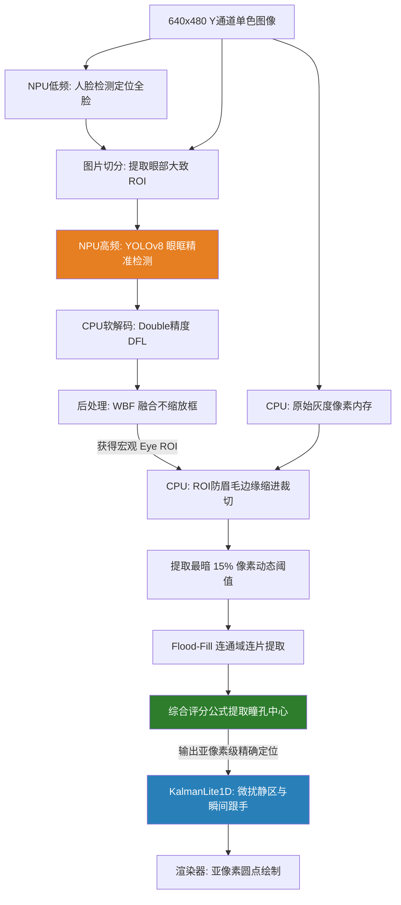

# SmartSens M1 Pro 高精度眼动追踪系统技术实现详解

传统的端到端深度学习眼动追踪经常受限于 NPU（尤其是 INT8 量化计算）引起的**坐标微小抖动**。为彻底解决这一问题，本系统在 SmartSens M1 Pro 平台上设计并实现了一套 **“NPU 宏观区域检测 + CPU 亚像素微观精定位”** 的双层混合高精度架构。

本说明文档将详细拆解系统的模块关系以及核心算法实现，从模型定制化训练、计算图切分，一直到后端滤波渲染。

---

## 1. 架构数据流 (Data Flow)

整个系统的运作流程如下，确保 NPU 负责识别极强鲁棒性的宏观特征，而 CPU 承担轻量精细且完全确定的点位校准：



---

## 2. 模型训练：单通道 YOLOv8 的定制与标注策略

为了迎合灰度传感器（红外/近红外摄像头），必须对官方版 YOLOv8 模型进行彻底的单通道改造，以节省大量无效的算力。

### 2.1 修改网络架构与单通道训练 (`yolov8n_gray.yaml`)
标准 YOLOv8 输入为 3 通道。若强行使用三通道推理灰度图会导致首层卷积算力被毫无意义地消耗。我们新建架构配置文件，把输入强行指定为单通道：
```yaml
nc: 1    # 仅检测 1 个类别 (eye)
ch: 1    # 强行限定底层网络为单通道，完美契合灰度 Sensor 输入
```

### 2.2 去除色彩破坏性增强
由于硬件只走单色数据流，我们将训练算法中打乱色彩平衡的增广彻底关闭，仅保留抗阴影明度波动以及几何畸变的参数：
```python
model.train(
    hsv_h=0.0, hsv_s=0.0, hsv_v=0.4, # 仅保留明度抗锯齿
    degrees=5, translate=0.15, scale=0.5, shear=3.0, fliplr=0.5
)
```

### 2.3 “画大框”的标注哲学
数据集标注**不再要求紧贴黑眼珠**，而是统一标注为**“涵盖内/外眼角、上下眼皮的大框区域”**。瞳孔中心提取工作被安全移交给背后的超高精度 CPU 处理管线，NPU 只需负责大面积面部特征的锚定。

---

## 3. ONNX 运算图重构：解除复杂拼接 (Graph Slicing)

YOLOv8 在导出时，原版 ONNX 会在网络的末端（Head）挂载大量极其繁琐的 `Reshape`, `Transpose` 和 `Concat` 算子，强行将多尺度的特征图捏合成一个巨大的 3D 张量。
在类似 M1 Pro 等追求极致效率的嵌入式 NPU 板块上，这些无参数的复杂胶水算子大概率无法利用硬件加速，甚至会强行切回 CPU 计算，带来极其可怕的延迟。

因此，我们在导出阶段，通过 Python 工具对模型计算图进行**物理斩断**，抛弃后端的拼接操作。

### 3.1 切分脚本 (`split_yolov8.py`)
```python
import argparse
from pathlib import Path
from typing import List, Optional
import onnx
from onnx.utils import extract_model

def split_yolov8_head_6_outputs(input_model: str, output_model: str):
    # 手动指定底层卷积块最后的物理裸输出卡扣，彻底隔断后续组合算子
    output_names = [
        "/model.22/cv3.0/cv3.0.2/Conv_output_0",  # cls 80x80 (小目标类别图)
        "/model.22/cv3.1/cv3.1.2/Conv_output_0",  # cls 40x40 (中目标类别图)
        "/model.22/cv3.2/cv3.2.2/Conv_output_0",  # cls 20x20 (大目标类别图)
        "/model.22/cv2.0/cv2.0.2/Conv_output_0",  # reg 80x80 (小目标回归图)
        "/model.22/cv2.1/cv2.1.2/Conv_output_0",  # reg 40x40 (中目标回归图)
        "/model.22/cv2.2/cv2.2.2/Conv_output_0",  # reg 20x20 (大目标回归图)
    ]
    extract_model(input_model, output_model, input_names=["images"], output_names=output_names)
    return output_model

if __name__ == "__main__":
    # 解析 args 并执行模型裁剪 ...
```

### 3.2 第 6 路裸张量输出与 C++ 解码的化学反应
裁剪使得模型彻底变回了一个极其标准的“矩阵卷积发生器”。在 C++ 端 (`eye_det_gray.cpp`)，我们利用接口拉取的不再是大一统矩阵，而是新鲜的 6 张裸特征图：
```cpp
ssne_getoutput(model_id, 6, outputs); // 完美对应裁切脚本里的 6 根通道
```
这彻底理顺了随后 C++ 端 `DecodeBranch` 的逻辑。对于每个特征尺度（如 80x80），C++ 能够直接去提取对应的第 $n$ 张 cls 及 reg 矩阵内存块进行纯数字运算：
* `cls` 图使用单数字 `Sigmoid()` 提炼概率。
* `reg` 图包含 64 个通道，C++ 将其塞入自构建的 `DFL()` 积分函数解算边缘像素距离。

---

## 4. NPU 部署与 C++ 底层解码 (`eye_det_gray.cpp`)

为了将前面的 6 裸通道数据化为真实的方框坐标，底层部署不仅追求速度，更被重新赋予以“浮点防失真”为主的处理逻辑。

### 4.1 高精度防累积误差解码 (Double DFL)
在 INT8 量化的回归图（`reg` 通道）中，提取坐标要通过指数分布（Softmax）做积分计算。在原本用单纯的 `float` 作为累加容器时，微小的量化偏差被指数疯狂拔高造成漂移。

我们强制在 DFL 提取中把承载体升格到了 `double`：
```cpp
static float DFL(const float* tensor, int start_channel, int spatial, int idx) {
    // ... 寻找极值点 max_val
    double sum = 0.0;
    double res = 0.0;
    for (int i = 0; i < 16; ++i) {
        float raw = tensor[(start_channel + i) * spatial + idx] - max_val;
        if (raw < -15.0f) raw = -15.0f;  // 防下溢出斩断异常数据
        double weight = std::exp(static_cast<double>(raw));
        sum += weight;
        res += weight * static_cast<double>(i);
    }
    return static_cast<float>(res / sum);
}
```

### 4.2 WBF 加权框融合
传统硬 NMS（非极大值抑制）会直接暴力的丢弃同重叠区的低分框。但是一旦次帧中不同位置的框由于光影分值翻转，坐标就会产生断层撕裂感。本方案的 **WBF (Weighted Box Fusion)** 将所有相互交错的目标框用置信度做引力混合位置均值，直接用**融合框原汁原味向后传递**（放弃之前用 `ShrinkBox` 强行缩放干扰中心的问题）。

---

## 5. CPU 亚像素级瞳孔提取 (`demo_face.cpp`)

在获得 NPU 的宏观大眼框后，C++ 开始在这狭小的窗格里计算极精位。

### 5.1 边缘消减保护
大眼眶框不可避免地将浓密睫毛与深邃的眼底包含在内。利用物理裁减直接封死它们：
```cpp
constexpr float kPupilInnerMarginXRatio = 0.10f;      // 左右切去 10%
constexpr float kPupilInnerTopMarginRatio = 0.20f;    // 顶部重切去 20% 防眉毛睫毛
constexpr float kPupilInnerBottomMarginRatio = 0.10f; // 底部切去 10% 防阴影
```

### 5.2 动态极暗阈值与不妥协的积分提取
通过在切出来的细微框体中绘制灰度级直方图，强行抽离 **Top 15% 黑度**的阈值（保证即使反光把瞳孔打碎也不丢失种子）：
```cpp
// [宽长比极其宽容] 哪怕眯眼、极度侧视，拉伸到极限 4.0 都能接受不开除！
if (aspect < 0.15f || aspect > 4.00f) continue;

// 打分逻辑彻底摒弃大块劫持。核心点：
// - 最纯正的黑 (255.0f - mean_dark)
// - 面积增益使用根号剧烈衰减 (std::sqrt(area))，致密的瞳孔反超巨大的浅色眼窝残影
// - 彻底解放框边拘束 (0.002f * dist2)，让眼球能在全视野眼眶中放飞游荡
float score = (255.0f - mean_dark) * std::sqrt(static_cast<float>(area)) * fill_ratio /
              (1.0f + 0.002f * dist2);
```

---

## 6. 消除悬滞：低阻尼追踪器 (`KalmanLite1D`)

原设定中带有巨大惯性阻尼的卡尔曼现在沦落成了“迟滞累赘”。系统现在追求：静止时纹丝不动抵抗噪波，转眼时绝对跟手（Zero-Delay）。

```cpp
constexpr float kKalmanQPos = 2.0f;      // 把位置预测空间放开到极大（高机动信任）
constexpr float kKalmanRCalm = 4.0f;     // 静止时过滤底层硬件 0.2px 微扰电平波动
constexpr float kKalmanRActive = 0.5f;   // 一启动立马把阻尼归零卡住坐标，绝对信任提取点

std::array<float, 4> ToBox() const {
    // 独有的亚像素防晃动粘合网格，即便底下有抖动偏差
    // 输出到屏幕必须 0.5 半像素卡死对齐，造就极静环境下的0横跳体验
    float cx = std::round(kcx.x * 2.0f) * 0.5f;
    float cy = std::round(kcy.x * 2.0f) * 0.5f;
    // ...
}
```

---

## 附：变量调优排障清单

| 故障现象 | 根源分析 | 解决建议 |
| :--- | :--- | :--- |
| **眼睛不动时，点在原地小范围飞舞** | NPU 退化或光线极差，导致 CPU 提取破碎或被排斥，回退到了 NPU 中心的脏跳值 | 检查 `kPupilDarkPercentile` 是否过苛，可调至 `0.20` 或增加 `kPupilMaxAreaRatio` 至 `0.6` |
| **动眼时，圆点有严重的粘滞拖尾感** | 卡尔曼滞留阻尼过大 | 缩小 `kKalmanRCalm` 至 `1.0` |
| **重度斜视时，圆点跟不上瞳孔卡在没到边的位置** | 强中心惩罚了离开中心的瞳孔 | 设置 `kPupilMaxShiftRatio` = `0.80`; 减小子项惩罚系数至 `0.001` |
